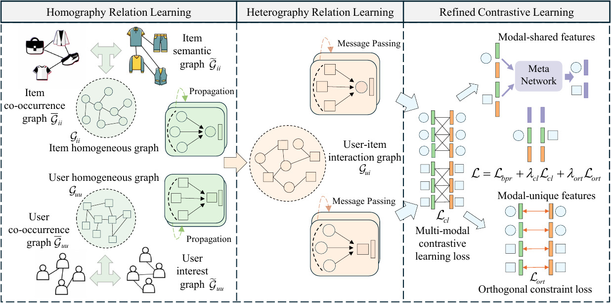

# REARM (MM'25)
This is our Pytorch implementation for "Refining Contrastive Learning and Homography Relations for Multi-Modal Recommendation":  
> Shouxing Ma, Yawen Zeng, Shiqing Wu, and Guandong Xu. 2025. Refining Contrastive Learning and Homography Relations for Multi-Modal Recommendation. In ACM MM`25, Dublin, Ireland, Oct. 27-31, 2025

## Overview of REARM
<p>

</p>

## Environment Requirement

The code has been tested running under Python 3.6. The required packages are as follows:

* pytorch == 1.13.0
* numpy == 1.24.4
* scipy == 1.10.1
## Data
Full data could be downloaded from DropBox: [Baby/Sports/Clothing](https://www.dropbox.com/scl/fo/ok1bso1v2gral5i3bq39p/h?rlkey=qtph647lid3d16mulv5rwvje6&dl=0)  

## Dataset

We provide three processed datasets: Baby, Sports, and Clothing.

| #Dataset   | #Interactions | #Users|#Items|Sparsity|
|  ----  | ----  | ----  |----  |----  |
|Baby|160,792|19,445|7,050|99.88%|
|Sports|296,337|35,598|18,357|99.96%|
|Clothing|278,677|39,387|23,033|99.97%|

## Example to Run the Codes

The instructions for the commands are clearly stated in the codes.

* Baby dataset
```
python main.py --dataset='baby'  --num_layer=4   --reg_weight=0.0005 --rank=3  --s_drop=0.4  --m_drop=0.6 --u_mm_image_weight=0.2  --i_mm_image_weight=0  --uu_co_weight=0.4 --ii_co_weight=0.2  --user_knn_k=40  --item_knn_k=10 --n_ii_layers=1 --n_uu_layers=1 --cl_tmp=0.6  --cl_loss_weight=5e-6 --diff_loss_weight=5e-5
```

* Sports dataset

```
python main.py --dataset='sports' --num_layer=5  --reg_weight=0.05 --rank=7  --s_drop=1  --m_drop=0.2 --u_mm_image_weight=0  --i_mm_image_weight=0.2  --uu_co_weight=0.9 --ii_co_weight=0.2  --user_knn_k=25  --item_knn_k=5 --n_ii_layers=2 --n_uu_layers=2 --cl_tmp=1.5  --cl_loss_weight=1e-3 --diff_loss_weight=5e-4
```

* Clothing dataset

```
python main.py --dataset='clothing' --num_layer=4  --reg_weight=0.00001 --rank=3  --s_drop=0.4  --m_drop=0.1 --u_mm_image_weight=0.1  --i_mm_image_weight=0.1  --uu_co_weight=0.7 --ii_co_weight=0.1  --user_knn_k=45  --item_knn_k=10 --n_ii_layers=1 --n_uu_layers=1 --cl_tmp=0.03  --cl_loss_weight=1e-6 --diff_loss_weight=1e-5
```


## REARM
The released code consists of the following files.
```
--data
    --baby
    --clothing
    --sports
--utils
    --configurator
    --data_loader
    --evaluator
    --helper
    --logger
    --metrics
    --parser              
--main
--model
--trainer
```
